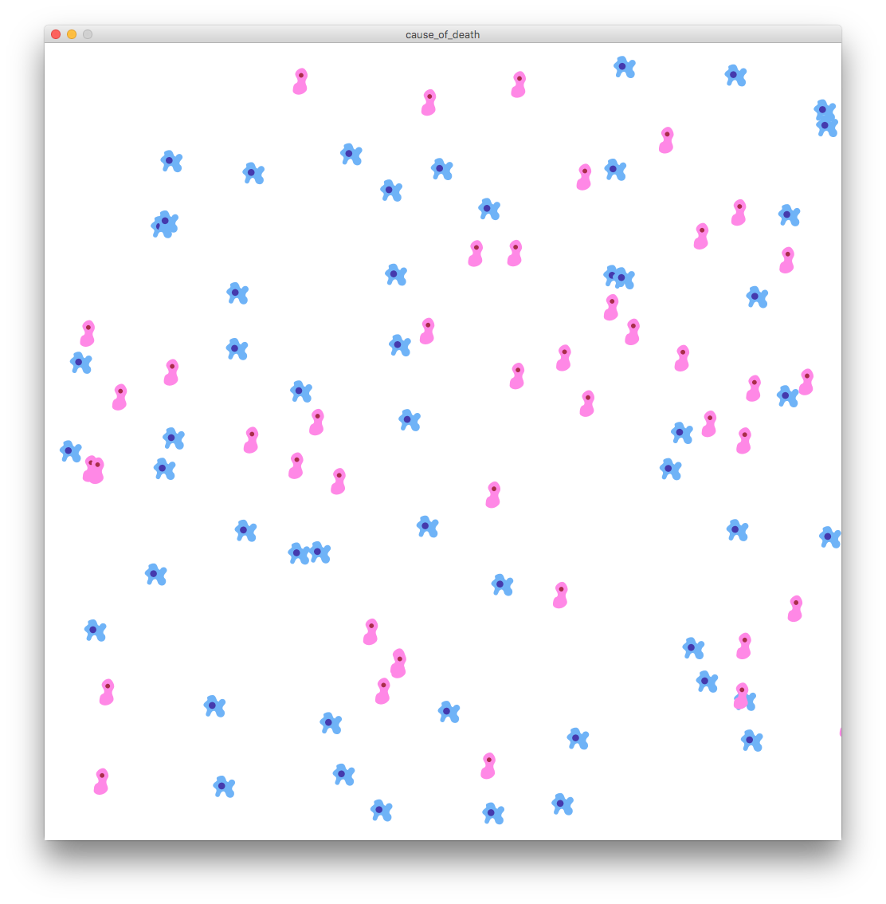

# Data Poster

Examples for the data-driven poster project.

## Soybean

Uses data related to soybean crops to create an image of a bean pod.

## Cause of Death

Use data on cause of death in NYC to show the distribution of male/female influenza deaths.
